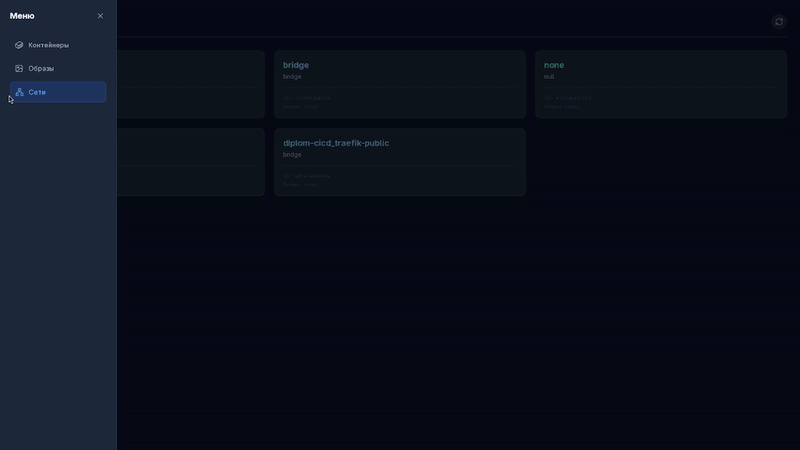

# 🐳 Dockpit

**Dockpit** — современный графический интерфейс для управления Docker контейнерами, образами и сетями, написанный на Rust (Tauri) + React + TypeScript.



## ✨ Возможности

- 📦 **Управление контейнерами**: запуск, остановка, перезапуск, удаление
- 📊 **Статистика в реальном времени**: CPU, Memory, Network I/O, Block I/O
- 📝 **Просмотр логов**: потоковые логи контейнеров в реальном времени
- 🔍 **Детальная информация**: переменные окружения, порты, volumes, сети
- 🖼️ **Управление образами**: просмотр локальных Docker образов
- 🌐 **Управление сетями**: информация о Docker сетях
- 🎨 **Современный UI**: темная тема, анимации, адаптивный дизайн

## 🖥️ Системные требования

### Общие требования для всех дистрибутивов:
- **Docker** или **Podman** (работает с обоими)
- **Rust** 1.70+ и **Cargo**
- **Node.js** 18+ и **npm**
- **WebKit2GTK** (для Tauri)

---

## 📦 Установка зависимостей по дистрибутивам

### 🔷 Arch Linux / Manjaro

```bash
# Обновление системы
sudo pacman -Syu

# Установка зависимостей Tauri
sudo pacman -S webkit2gtk base-devel curl wget file openssl gtk3 librsvg

# Установка Rust (если еще не установлен)
curl --proto '=https' --tlsv1.2 -sSf https://sh.rustup.rs | sh
source $HOME/.cargo/env

# Установка Node.js и npm
sudo pacman -S nodejs npm

# Установка Docker
sudo pacman -S docker docker-compose

# Запуск и автозапуск Docker
sudo systemctl start docker
sudo systemctl enable docker

# Добавление пользователя в группу docker (чтобы не использовать sudo)
sudo usermod -aG docker $USER
# ВАЖНО: Перезайдите в систему или выполните: newgrp docker
```

### 🔶 Ubuntu / Debian / Linux Mint

```bash
# Обновление системы
sudo apt update && sudo apt upgrade -y

# Установка зависимостей Tauri
sudo apt install -y libwebkit2gtk-4.0-dev \
    build-essential \
    curl \
    wget \
    file \
    libssl-dev \
    libgtk-3-dev \
    libayatana-appindicator3-dev \
    librsvg2-dev

# Установка Rust
curl --proto '=https' --tlsv1.2 -sSf https://sh.rustup.rs | sh
source $HOME/.cargo/env

# Установка Node.js 18+ (через NodeSource)
curl -fsSL https://deb.nodesource.com/setup_20.x | sudo -E bash -
sudo apt install -y nodejs

# Установка Docker
sudo apt install -y docker.io docker-compose

# Запуск и автозапуск Docker
sudo systemctl start docker
sudo systemctl enable docker

# Добавление пользователя в группу docker
sudo usermod -aG docker $USER
# ВАЖНО: Перезайдите в систему или выполните: newgrp docker
```

### 🔴 Fedora / RHEL / CentOS

```bash
# Обновление системы
sudo dnf update -y

# Установка зависимостей Tauri
sudo dnf install -y webkit2gtk4.0-devel \
    openssl-devel \
    curl \
    wget \
    file \
    gcc \
    gcc-c++ \
    gtk3-devel \
    librsvg2-devel

# Установка Rust
curl --proto '=https' --tlsv1.2 -sSf https://sh.rustup.rs | sh
source $HOME/.cargo/env

# Установка Node.js
sudo dnf install -y nodejs npm

# Установка Docker
sudo dnf install -y docker docker-compose

# Запуск и автозапуск Docker
sudo systemctl start docker
sudo systemctl enable docker

# Добавление пользователя в группу docker
sudo usermod -aG docker $USER
# ВАЖНО: Перезайдите в систему или выполните: newgrp docker
```

### 🟢 openSUSE

```bash
# Обновление системы
sudo zypper refresh && sudo zypper update -y

# Установка зависимостей Tauri
sudo zypper install -y webkit2gtk3-devel \
    libopenssl-devel \
    curl \
    wget \
    file \
    gcc \
    gcc-c++ \
    gtk3-devel \
    librsvg-devel

# Установка Rust
curl --proto '=https' --tlsv1.2 -sSf https://sh.rustup.rs | sh
source $HOME/.cargo/env

# Установка Node.js
sudo zypper install -y nodejs npm

# Установка Docker
sudo zypper install -y docker docker-compose

# Запуск и автозапуск Docker
sudo systemctl start docker
sudo systemctl enable docker

# Добавление пользователя в группу docker
sudo usermod -aG docker $USER
# ВАЖНО: Перезайдите в систему или выполните: newgrp docker
```

---

## 🚀 Установка и запуск Dockpit

### 1. Клонирование репозитория

```bash
git clone https://github.com/yourusername/dockpit.git
cd dockpit
```

### 2. Установка зависимостей Node.js

```bash
npm install
```

### 3. Запуск в режиме разработки

#### Для обычных окружений (GNOME, KDE, XFCE и т.д.):

```bash
npm run tauri:dev
```

#### Для Wayland композиторов (Hyprland, Sway и т.д.):

```bash
WEBKIT_DISABLE_COMPOSITING_MODE=1 npm run tauri:dev
```

**Примечание**: На Hyprland и других тайловых композиторах Wayland может потребоваться отключение композитинга для корректной работы WebKit.

### 4. Сборка production версии

```bash
npm run tauri:build
```

Собранное приложение будет находиться в `src-tauri/target/release/bundle/`

---

## 🐋 Конфигурация Docker

### Подключение к Docker socket

По умолчанию Dockpit подключается к Docker через Unix socket:
- Linux: `/var/run/docker.sock`

Убедитесь, что ваш пользователь добавлен в группу `docker`:

```bash
# Проверить принадлежность к группе
groups $USER

# Если docker нет в списке, добавить:
sudo usermod -aG docker $USER

# Применить изменения (или перезайдите в систему)
newgrp docker
```

### Использование с Podman

Dockpit также работает с Podman! Создайте симлинк для совместимости:

```bash
# Включить Podman socket
systemctl --user enable --now podman.socket

# Создать симлинк (опционально, для совместимости)
sudo ln -s /run/user/$UID/podman/podman.sock /var/run/docker.sock
```

---

## 📁 Структура проекта

```
dockpit/
├── src/                    # React frontend
│   ├── App.tsx            # Главный компонент приложения
│   ├── App.css            # Стили (не используется, используется Tailwind)
│   └── index.css          # Глобальные стили Tailwind
├── src-tauri/             # Rust backend
│   ├── src/
│   │   └── main.rs        # Главный файл Rust с командами Tauri
│   ├── Cargo.toml         # Зависимости Rust
│   └── tauri.conf.json    # Конфигурация Tauri
├── package.json           # Зависимости Node.js
└── README.md              # Этот файл
```

---

## 🔧 Технологии

- **Frontend**: React 18, TypeScript, Tailwind CSS
- **Backend**: Rust, Tauri v2, Bollard (Docker API)
- **Icons**: Lucide React

---

## 📝 Лицензия

MIT License - см. файл LICENSE

---

## 🤝 Вклад в проект

Приветствуются Pull Request'ы! Для больших изменений сначала откройте Issue для обсуждения.

---

## 🐛 Известные ограничения

1. **Только локальный Docker**: В текущей версии поддерживается только локальное подключение к Docker socket
2. **Wayland композиторы**: Может потребоваться `WEBKIT_DISABLE_COMPOSITING_MODE=1`
3. **Статистика**: Доступна только для запущенных контейнеров

---

## 📞 Контакты

- GitHub: [github.com/yourusername/dockpit](https://github.com/Dmitriy382/dockpit)
- Issues: [github.com/yourusername/dockpit/issues](https://github.com/Dmitriy382/dockpit/issues)

